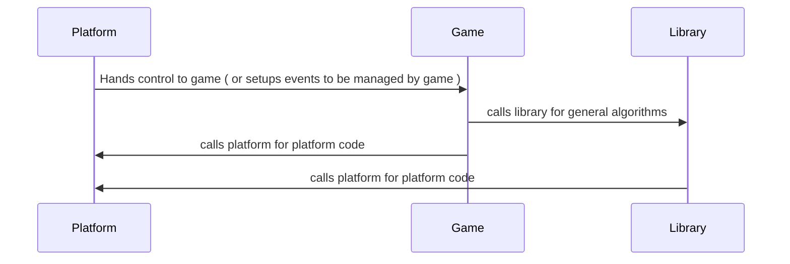
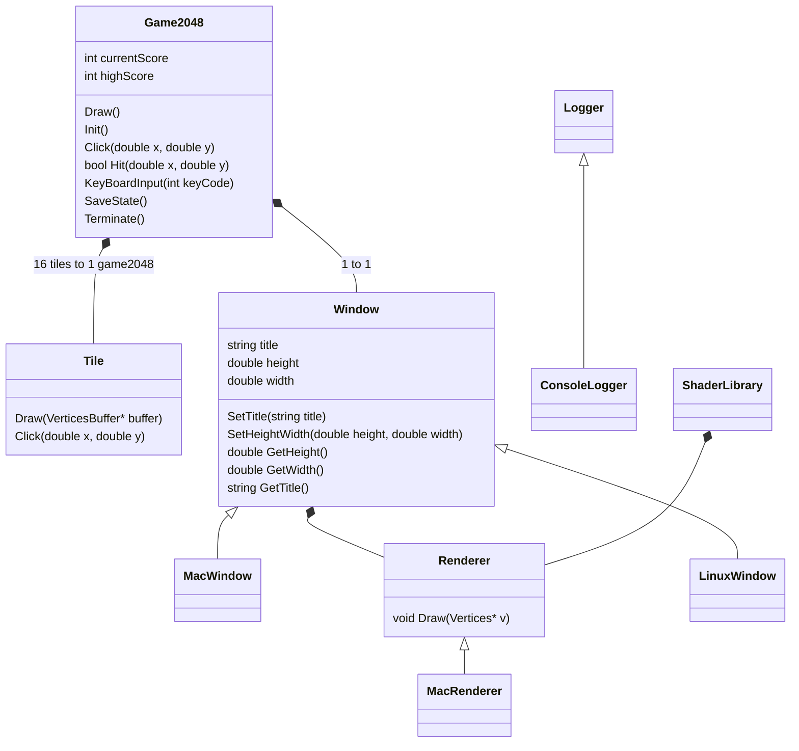

# 2048 From Scratch

#### Graphics From Scratch

## Description

2048 From Scratch is a test bed for write one or more libraries for creating graphical applications and games

## Current Project Structure

The project is split between platform specific code, shared library code, and game code

The platform specific code is located in directories containing the associated platform (E.g. linux specific code is in the linux directory)

All game logic is located in game code.

Platform specific code is located in their respective directories

Shared logic code and game logic code are currently cross platform


## Build Instructions

The project is currently configured to auto detect the operation system and use the appropriate target for the operating system.

### Build MacOS

You must use xcode to build the MacOS target since it currently uses a .xib which is not compiled using unix makefiles

```sh
cmake -G Xcode -B xcode
```

The above command will generate an xcode project located in xcode. Open the project with xcode and compile it.

### Build Linux

Requires X11 & GL standard header files on linux. 
In the base directory
```sh
cmake -B build
```

then cd into ``builds/``

run
```sh
make
```
binary will be compiled and you may run ``./2048FS``

## Developer Notes

The symlink for compile_commands.json is for a cmake generated file located in the generated build directory. Use the following command
to create it.

```sh
cmake -Bbuild -DCMAKE_EXPORT_COMPILE_COMMANDS=1
```

## Architecture

The Currrent Architecture has a weird flow.

Each platform targets has code specific for their platforms and are entry points. The generated executables are for each platform. The platforms provide platform logic for the game object and for the underlying libraries. The platforms provide glue code and execution flow.


### Library Classes

#### Notes:
-

### classes
#### Graphic classes
- There will be classes to draw basic objects ( rectangles, circles, etc.)

### Game Classes
#### Notes:
- Game classes model objects in the game and the game itself ( basic business logic )

#### classes
- Game2048 (main object)
	- Its the program object.
	- In a program, there will be only one instance of the class
	- All game state will be managed by Game2048 ( platform specific not withstanding)
		- platform specific code lifetimes are to the entire program which is equivalent to Game2048
	- Init()
		- All dependencies ( such as window ) must be injected into this object before init()
	- Draw() 
		- will render a new frame
	- Click(double x, double y)
		- Click or Touch event will trigger a call to this function
	- KeyBoardInput(keyCode)
	- SaveState()
		- Saves the current state to static storage
		- JSON or XML format
	- Terminate() 
		- Terminates the game
	- Contains Tiles
- Tile
	- Tile is a tile in 2048 
	- Tile renders itself, its contents ( mainly the number ) and will handle click detection
	- Draw() 
		- Renders itself using Library

